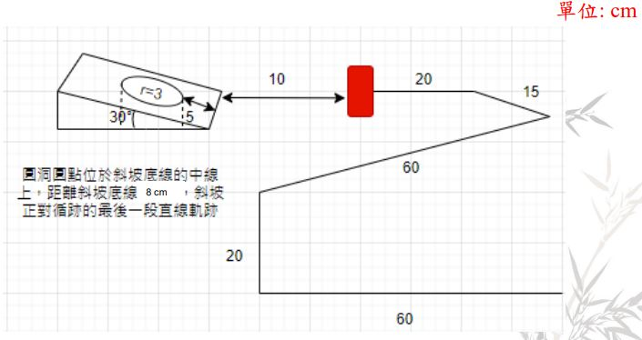
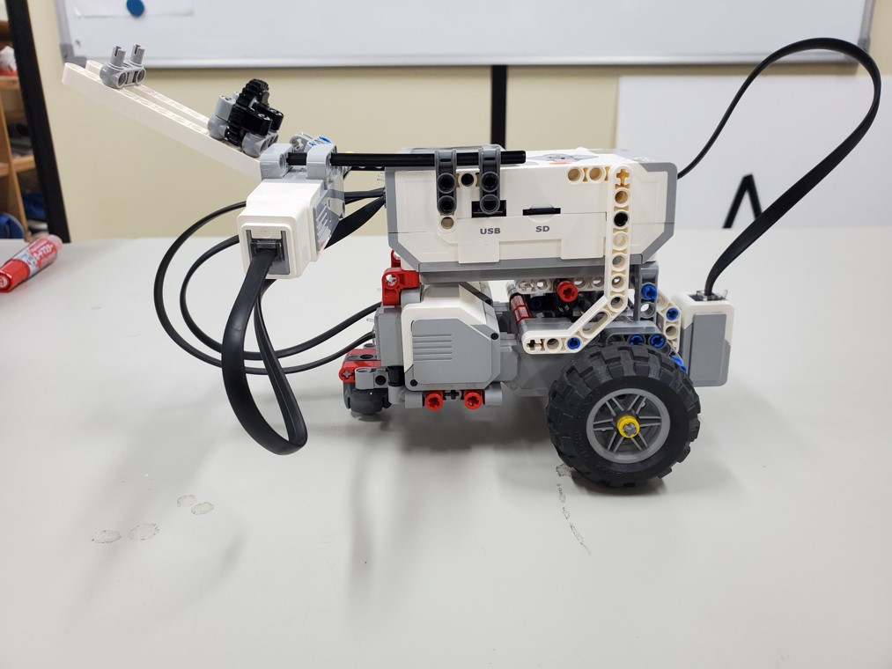
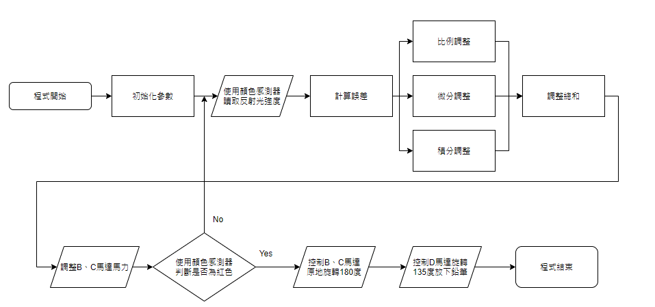

# 循跡投筆車
圖中紅色方塊為準備投筆位置，筆需要投入的區域為一斜坡上的圓洞。

Exp1 Report : [Link](Exp1_report.pdf)

## 機構

## 程式流程圖

## DEMO

https://user-images.githubusercontent.com/42777325/140555921-716e5565-9781-4b0b-bb94-62b5e256623b.mp4
