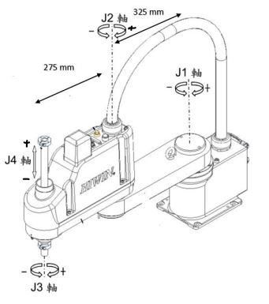
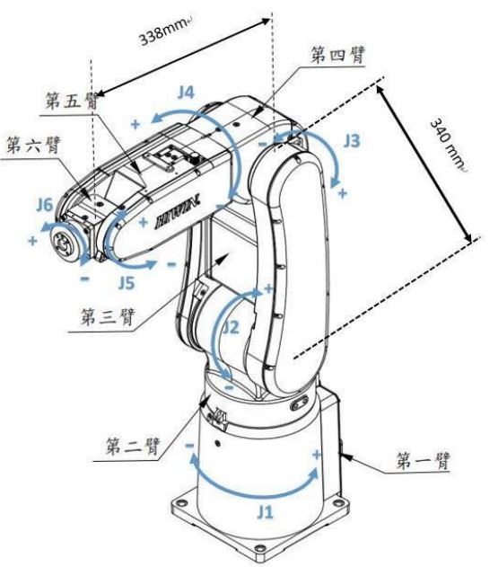

# SCARA(4Dof)與上銀六軸(6Dof)使用
1. 操作SCARA並無碰撞的伸進鋁罐中

2. 操作上銀六軸來寫NTU

Exp2 Report : [Link](Exp2_report.pdf)

DH Table Tester and Visualization : [Link](DHTable_tester.ipynb)

## 機構
### SCARA (4Dof)

### 上銀六軸 (6Dof)

